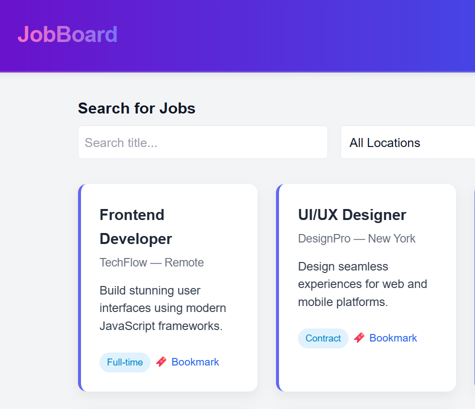

# JobBoard

A small job listing site that reads like a newspaper classifieds page instead of a grid of SaaS cards.

**Live:** https://nabintousfofana.github.io/JobBoard/



## What it does

A two-page job board:

- **The listings page** has search across title, company, and description, plus location and type filters that populate dynamically from the data. Each row has a save button.
- **The bookmarks page** shows everything you've saved, with a live count in the nav.

I designed it as numbered classifieds rows instead of cards, so you can scan twenty listings without scrolling. While building the new layout I also caught a bug in the original JSON file — the same job ID appeared twice, which meant saving one entry flagged both copies as saved. Fixed.

## Features

- Numbered classifieds rows (title, company, location, salary, type tag, posted date, save button)
- Search across title, company, and description
- Location and type filters populated from the data
- Bookmarks page with a live counter in the nav
- "Clear filters" link to reset state
- Small toast confirms saves and removes
- Works from a plain `file://` open — the jobs data is inlined into `index.html` as a `<script type="application/json">` block, so no server is needed

## Run it locally

```bash
git clone https://github.com/NabintouSFofana/JobBoard.git
cd JobBoard
# Open index.html in your browser. That's it.
```

You can serve it with `npx serve .` if you prefer, but you don't have to.

## Built with

HTML, CSS, vanilla JavaScript. No frameworks, no build step.

## What I learned

`fetch` (and how to design around it failing), JSON, filtering, `localStorage`, debounced search. The bigger thing was about layout choice — I started with the usual cards-on-grid pattern and twenty listings already felt cluttered. Switching to numbered rows like an old newspaper section let me show three times as many jobs on one screen. Sometimes the answer isn't a better card; it's not using cards.

## License

MIT — see [LICENSE](LICENSE).

---

Built by [Nabintou S. Fofana](https://nabintousfofana.github.io/portfolio/) · 2025
